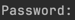

# RabbitGetter

Welcome to RabbitGetter! This is a side project created by me, and I will update it frequently with interesting content.

This project serves as an index for all my projects, blogs, and other related stuff.

You can find all the projects below:

- [HomePage](https://github.com/meowalien/homepage) - My resume and the entry point for all projects.
- [HomapageI18n](https://github.com/meowalien/homapage-i18n) - Provides all the multi-language resources needed for all
  projects.
- [HomePageClusterConfig](https://github.com/meowalien/homepage-cluster-config) - The ArgoCD configuration for the
  cluster that runs everything.
- [PriceReporter](https://github.com/meowalien/price-reporter) - A price reporter that sends the price of a stock to a
  RabbitMQ queue.
- [AccountOperator](https://github.com/meowalien/account-operator) - The account operator that manages all the accounts.
- [HomepageAuthorization](https://github.com/meowalien/homepage-authorization) - The authorization service for all
  projects.

## How to run this project on-premise (MacOS)

1. Install needed tools

   Fallow the instructions on the official website:

   orbstack(Docker): https://docs.orbstack.dev/quick-start

   minikube: https://minikube.sigs.k8s.io/docs/start/?arch=/macos/arm64/stable/homebrew

   kubectl: https://kubernetes.io/docs/tasks/tools/install-kubectl-macos/
   
   kubevpn: https://github.com/kubenetworks/kubevpn
    ```shell
    # you can skip this step if you have already installed docker
    brew install orbstack
    brew install kubectl
    brew install minikube
    brew install kubevpn
    brew install argocd
    ```
2. Pull all the projects
    ```shell
   {
    mkdir -p ./RabbitGather
    cd ./RabbitGather
    git clone -b minikube https://github.com/meowalien/homepage-cluster-config.git
    git clone -b minikube https://github.com/meowalien/homapage-i18n.git
    git clone -b minikube https://github.com/meowalien/homepage.git
   }
    ```
3. Start a cluster and make a vpn tunnel into the cluster
    >This step may require you to input your password, you may see a prompt asking for your password like this:
    
    ```shell
    {
    cd ./homepage-cluster-config
    ./start.sh
    }
    ```
4. Deploy needed dependencies
    ```shell
    ./deploy_dependencies.sh
    ```
5. Build and push the images to the local registry in minikube
    ```shell
    {
    cd ../homapage-i18n
    ./ci.sh
    # insert initial data
    ./insert_data.sh
    cd ../homepage
   ./ci.sh
   }
    ```
6. Deploy the projects
    ```shell
    {
    cd ../homepage-cluster-config
    ./deploy_applications.sh
    }
    ```
7. Visit the homepage
    > If any of the URL below does not work, you may need to wait for a few minutes for the services to be ready.
    
    Go to `http://homepage-service.homepage.svc.cluster.local` in your browser, you should see the homepage.
    
    Go to `http://argocd-server.argocd.svc.cluster.local` in your browser, you should see the ArgoCD dashboard, the username is `admin`, the password will be `password`.
8. Clean up
    ```shell
   {
    cd ../homepage-cluster-config
    ./stop.sh
    cd ../../
    rm -rf ./RabbitGather
    }
    ```
